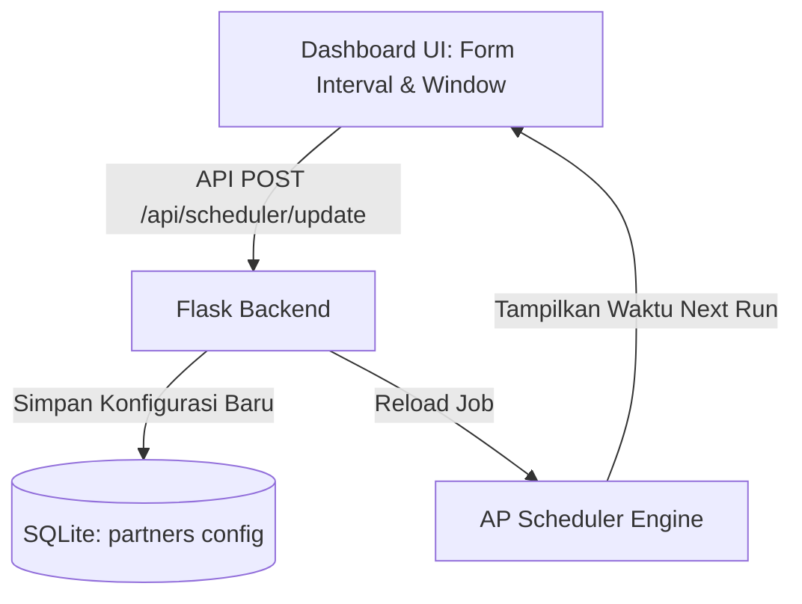
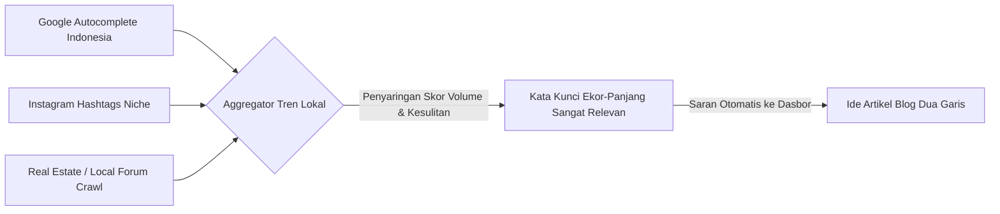

# Cetak Biru: Evolusi Otomasi AutoSEO & Alur Kerja Centaur (Human-in-the-Loop)

Dokumen ini membedah rencana strategis untuk memperkuat keunggulan otomasi AutoSEO Enterprise, sekaligus memadukan kontribusi nyata manusia (*human-in-the-loop*) guna mematahkan algoritma deteksi AI generik serta memenangkan persaingan Google Search Engine secara organik.

---

## 1. Pemetaan Masalah & Solusi (The Core Breakdown)

Berikut adalah breakdown masalah nyata dalam SEO otomatisasi murni vs solusi yang akan kita bangun:

| Aspek | Masalah SEO Otomatisasi Murni | Solusi Pendekatan Centaur (Manusia + AI) |
| :--- | :--- | :--- |
| **E-E-A-T (Kepercayaan)** | Google mendeteksi konten "dingin" yang ditulis tanpa pengalaman nyata. Konten terasa seperti kompilasi teori generik Wikipedia. | **Input Kolaboratif (Human Inputs Experience)**: Pengguna memasukkan poin-poin lapangan mentah (contoh: foto lokasi, masalah tanah), AI mengembangkan cerita emosional di sekitar poin tersebut. |
| **Transparansi Otomasi** | Penjadwal (*scheduler*) berjalan di terminal terpisah secara tidak kasat mata, membuat pengguna dashboard cemas kapan postingan berjalan. | **Dasbor Kontrol Penjadwalan Terintegrasi**: Tampilan visual waktu riil kapan pipa berikutnya berjalan, lengkap dengan tombol jeda/mulai serta penyesuaian interval langsung dari UI. |
| **Kekakuan Konten** | AI menulis artikel tanpa mengetahui tren mikro lokal yang sedang meledak di forum-forum Indonesia minggu ini. | **Kolektor Tren Lokal Agresif**: Melacak kata kunci ekor-panjang (*long-tail keywords*) yang sedang dicari secara lokal sebelum kompetitor korporat menyadarinya. |
| **Kelemahan Algoritma** | Google memperbarui algoritma inti (*core update*), situs kehilangan trafik, dan sistem otomatis tetap menulis dengan pola lama yang tidak disukai Google lagi. | **Fitur Deteksi Penurunan Rata-rata Peringkat**: Memberikan peringatan visual darurat dan menyarankan opsi re-optimasi postingan lama. |

---

## 2. Fitur 1: Memperkuat Penjadwalan (Otomasi Terkontrol)

Saat ini, scheduler berjalan pada script python independen `core/scheduler.py` yang tidak terhubung langsung ke antarmuka front-end. 

### Rencana Desain UI Kontrol Scheduler:
* Kita akan menambahkan **"Panel Pengendali Waktu & Scheduler"** di dasbor samping atau tab pengaturan dasbor.
* **Metrik Real-time**: Menampilkan sisa jam menuju pipeline run berikutnya (contoh: `"⏰ Running in: 14 Jam 25 Menit (Kamis, 09:00 WIB)"`).
* **Pengaturan Interaktif**: Input untuk mengubah minimum/maksimum interval jam posting secara langsung, serta memilih jam-jam aktif (*engagement windows*) lewat antarmuka tombol kapsul yang estetik.

---

## 3. Fitur 2: Alur Kerja Human-in-the-Loop (Claude Storytelling)

Untuk mengalahkan kesan "konten buatan robot", kita akan menerapkan konsep **Human Outline + AI Soul**. Claude (atau LLM pendukung) sangat andal dalam menangkap emosi jika diberikan arahan kepribadian (*persona guidelines*) yang kuat.

### Alur Kerja di Studio Penulisan Blog:
1. **Pemicu Ide (AI)**: Sistem menyarankan topik berdasarkan riset tren lokal.
2. **Kolom "Pengalaman Lapangan Anda" (Manusia)**: Kami menyediakan kolom input kosong di dasbor bertuliskan:
   > *"Berikan 2-3 baris fakta proyek nyata Anda (contoh: lokasi proyek, jenis rumput yang mati, jenis pupuk yang Anda gunakan)."*
3. **Penyusunan Konten Berjiwa Emosi (AI - Claude)**: 
   AI akan membaca fakta mentah tersebut dan menyisipkan kalimat-kalimat emosional berempati tinggi:
   * **Sebelumnya (AI Generik)**: *"Cara menanam rumput jepang sangat mudah. Langkah pertama adalah membersihkan tanah..."*
   * **Setelahnya (AI Centaur)**: *"Minggu lalu, tim kami di BSD menghadapi masalah klasik: tanah lempung yang keras membuat rumput gajah mini klien kami menguning dan membusuk setelah hujan lebat. Berikut adalah rahasia bagaimana kami mengatasinya dengan teknik resapan split 2x2..."*

---

## 4. Fitur 5: Kolektor Tren Lokal yang Lebih Agresif

Banyak alat riset kata kunci korporat hanya memantau volume pencarian bulanan skala nasional. Akibatnya, mereka terlambat menangkap tren mikro yang sedang hangat diperbincangkan.

### Bagaimana Kolektor Tren Lokal Bekerja secara Agresif?
Sistem tidak hanya memantau Google Trends global, melainkan melakukan ekstraksi bertingkat pada sumber-sumber lokal Indonesia:

### Keuntungan Taktis:
* **Deteksi Kata Kunci Ekor-Panjang (*Long-Tail Keywords*)**: 
  Alih-alih bersaing memperebutkan kata kunci sulit berbiaya mahal seperti `"jasa pembuatan taman"`, sistem akan menyarankan kata kunci ekor-panjang spesifik lokal seperti *"harga rumput jepang per meter di Serpong"* atau *"tukang taman murah daerah BSD"*.
* **Persaingan Rendah, Konversi Tinggi**: Kata kunci ekor-panjang memiliki volume pencarian lebih kecil, namun niat transaksi (*buying intent*) pencarinya sangat tinggi.

---

## 5. Fitur 4: Kesiapan Algorithmic Adaptability

Jika terjadi pembaruan algoritma Google secara mendadak yang menargetkan spam konten AI, dasbor kita siap mengamankan peringkat website.

### Fitur Adaptabilitas yang Akan Disiapkan:
1. **Detektor Kejatuhan Peringkat (Ranking Drop Alert)**:
   Jika nilai rata-rata peringkat kata kunci Google di SQLite menurun melebihi batas toleransi (misalnya turun 4 strip dalam 5 hari), dasbor akan memancarkan lencana peringatan:
   > `⚠️ Peringatan Kritis: Fluktuasi Google Terdeteksi pada Niche Tanaman Hias`
2. **Re-Optimize Pipeline**:
   Sebuah tombol khusus di dasbor samping artikel untuk memicu AI menulis ulang paragraf pembuka dan penutup artikel lama dengan memasukkan kata kunci tren baru, agar Google melihat artikel tersebut terus diperbarui secara aktif (*freshness signals*).
